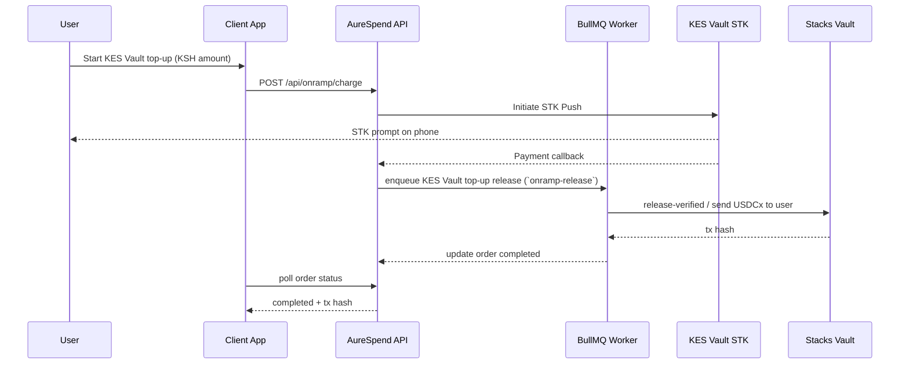
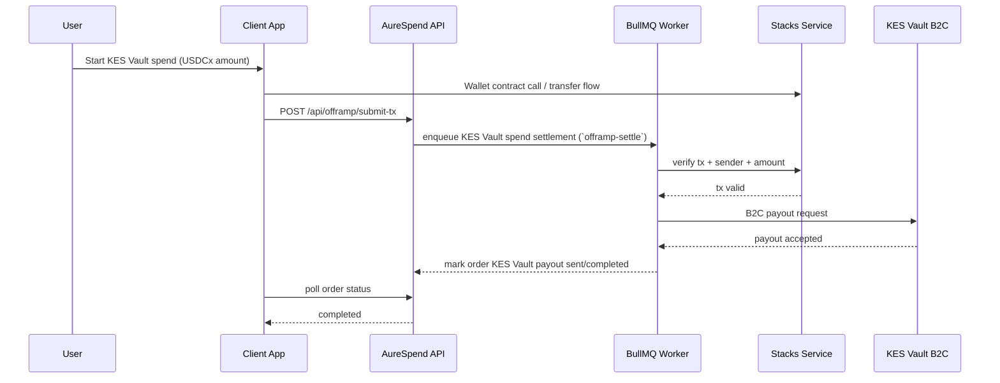
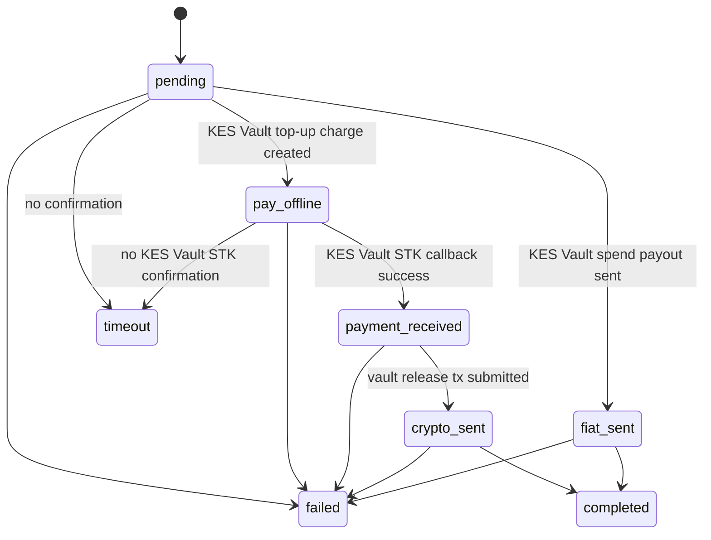
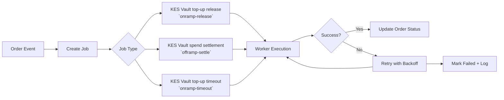
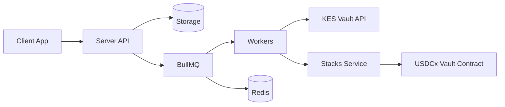
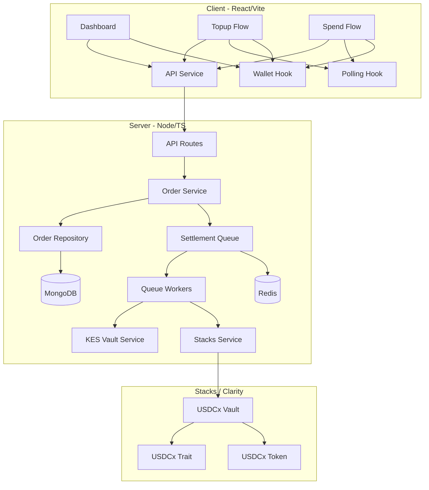
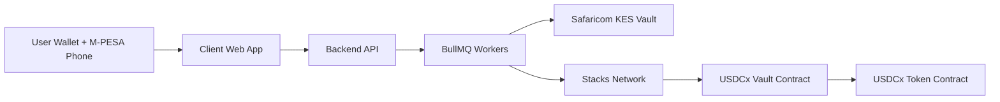
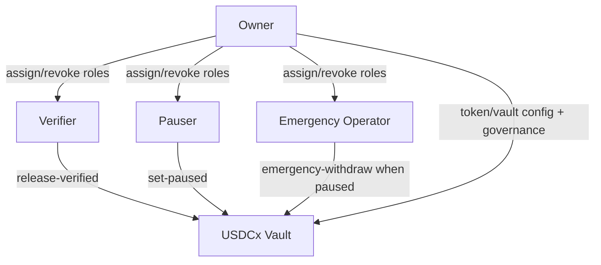

# We are Stripe for USDCx payments on Stacks

<div align="center">


</div>

## AureSpend

Pay bills using USDCx to Kenyan shillings anywhere.

Buy USDCx directly using KSH.

AureSpend is a KES Vault ↔ USDCx settlement platform on Stacks, combining secure vault contracts, a queue-driven backend, and a modern web client for top-up/spend experiences.

## Description

**We are Stripe for USDCx payments on Stacks.**

## Problem

A freelance developer in Nairobi gets paid **500 USDCx**.

He still needs to pay rent, buy groceries, and take a matatu in **Kenyan shillings**. His crypto becomes idle value, or he is pushed into risky, informal, and often expensive peer-to-peer deals.

This is the real gap AureSpend solves: turning digital dollar balances into safe, everyday local spending power.

## Solution

AureSpend provides a direct bridge between USDCx and Kenyan daily life:

- **Top-up USDCx with Kenyan Shillings directly**
- **Spend USDCx in KSH and pay any bill**
- **Non-custodial by design** — users keep control of their keys

### What Kenyans can directly pay after converting USDCx to KSH

- **Rent and house payments**
- **Electricity tokens and postpaid power bills (KPLC)**
- **Water bills**
- **Internet and home fiber (Safaricom, Airtel, Faiba and others)**
- **Mobile airtime and data bundles**
- **TV subscriptions (DStv, GOtv, Startimes)**
- **School fees and education payments**
- **Insurance premiums**
- **Transport and daily commuting costs (including matatu fare via M-PESA wallet funding)**
- **Small business supplier and merchant payments**

Instead of forcing users to exit into centralized exchanges or trust unknown P2P counterparties, AureSpend gives a clean payments-style flow backed by smart contracts and local fiat rails.

## Value Proposition

### For Users
- Get paid in USDCx and spend in KSH without leaving the crypto ecosystem.
- Use one trusted flow for both KES Vault top-up and KES Vault spend.
- Avoid hidden spreads, delays, and social risk from informal swaps.

### For the Ecosystem
- Converts passive USDCx holders into active spenders.
- Increases practical utility of Stacks-based stable value.
- Expands real-world crypto usage beyond speculation.

## Why AureSpend

Unlike centralized exchanges or ad-hoc peer-to-peer channels, AureSpend is built **natively on Stacks**.

- **Stacks-first architecture** for contract-level settlement controls
- **Bitcoin finality + smart contracts** for secure, low-fee transaction flows
- Designed for **freelancers, creators, and remote workers in Kenya**
- Delivers measurable impact by making USDCx useful in everyday payments

This monorepo contains three core systems:
- **contracts/**: Clarity vault and trait contracts for role-based token custody and release.
- **server/**: Node.js/TypeScript settlement API with MongoDB, Redis/BullMQ, KES Vault integration, and Stacks adapters.
- **client/**: React/Vite frontend for order creation, payment progression, and status tracking.

## What It Solves

Cross-rail payments (mobile money + blockchain) are hard to run safely at scale.

AureSpend addresses:
- unreliable asynchronous settlement sequences,
- replay/double-settlement risk,
- weak operational controls for privileged actions,
- poor observability across fiat and on-chain transitions.

## How It Solves It

1. **Contract-enforced custody controls**
	- Role-based verification and replay-safe vault release paths.
2. **Backend orchestration with job queues**
	- BullMQ handles retries, delayed timeouts, and durable workflows.
3. **KES Vault + Stacks integration boundaries**
  - Clear service abstraction for fiat and on-chain execution.
4. **Stateful order lifecycle**
	- MongoDB-backed status tracking and log history.
5. **Operational security defaults**
	- Validation, rate limits, secure headers, and controlled environment configuration.

## Key Features

### 1) End-to-End KES Vault Top-up Flow
- Initiates KES Vault STK push.
- Verifies KES Vault payment callback.
- Releases USDCx to user after confirmation.

### 2) End-to-End KES Vault Spend Flow
- Accepts user spend submission.
- Verifies chain-side transaction.
- Triggers KES Vault B2C settlement.

### 3) Security-First Vault Contract
- Owner + role governance.
- Pause and emergency controls.
- Unique payout-id replay protection.

### 4) Reliable Async Settlement Engine
- Queue retries with exponential backoff.
- Delayed timeout jobs for stale flows.
- Auditable order logs for every transition.

## Architecture & System Design

### 1) How AureSpend Works

#### Description

AureSpend coordinates two payment rails in one user journey:
- **Fiat rail** through M-PESA (KES Vault)
- **Crypto rail** through Stacks contracts

The backend orchestrates these rails using durable job queues and order-state tracking, while the frontend provides real-time visibility.

#### Flow Steps

##### KES Vault Top-up (KSH → USDCx)
1. User enters KSH amount and confirms top-up.
2. Backend initiates M-PESA STK push.
3. KES Vault callback confirms payment.
4. Queue worker triggers vault release.
5. USDCx is sent to the user wallet.
6. Order status becomes `completed`.

##### KES Vault Spend (USDCx → KSH)
1. User enters amount and phone number.
2. User signs/sends USDCx transfer flow.
3. Backend receives tx details and enqueues verification.
4. Worker verifies chain-side transaction.
5. Worker triggers KES Vault B2C payout.
6. Order status becomes `completed` after successful disbursement.

### KES Vault Top-up Sequence Diagram



### KES Vault Spend Sequence Diagram



### Settlement State Machine



### Queue Job Lifecycle



### 2) High-Level Architecture



### 3) Detailed Component Design



### 4) Infrastructure & External Rails



## Why This System Is Strong, Secure, and Robust

- **Contract-level safety controls**: role-based permissions, pause controls, emergency flows, and replay protection.
- **Reliable async processing**: queue retries with exponential backoff and delayed timeout jobs.
- **State integrity**: durable MongoDB order lifecycle with auditable status and log history.
- **Operational resilience**: isolated service adapters, callback handling, and recoverable worker execution.
- **Security-first defaults**: validation, rate limiting, secure headers, and environment-based secret management.

### Contract Security Model (Roles)



## Repository Structure

```text
.
├─ client/      # React + Vite frontend
├─ server/      # Node.js + TypeScript settlement backend
└─ contracts/   # Clarity smart contracts (vault + traits)
```

## Quick Start

### 1) Contracts

```bash
cd contracts
clarinet check
```

### 2) Server

```bash
cd server
npm install
cp .env.example .env
npm run dev
```

### 3) Client

```bash
cd client
npm install
npm run dev
```

## Reviewer Quick Guide

For technical reviewers, this is the fastest high-signal validation path:

1. **Contracts correctness**
  - Run `clarinet check` in `contracts/`.
  - Inspect role-gated methods and replay-protection logic in `usdcx-vault.clar`.
2. **Backend robustness**
  - Run `npm run check` and `npm run build` in `server/`.
  - Confirm queue workers, retries, and timeout jobs are active.
3. **Client flow integrity**
  - Run `npm run build` in `client/`.
  - Validate top-up and spend UI transitions and order polling behavior.
4. **End-to-end behavior**
  - Create a top-up order and observe `pending → pay_offline → payment_received → completed`.
  - Create a spend order and observe `pending → fiat_sent → completed`.

## Security & Robustness Guarantees

- **Non-custodial user model**: users keep control of wallet keys.
- **Contract safety boundaries**: role-based controls, replay-safe payout IDs, pause/emergency operations.
- **Deterministic settlement orchestration**: queue-driven execution with retries and timeout handling.
- **Traceable state transitions**: every order transition is persisted and auditable.
- **Operational hardening**: validation, rate limits, secure headers, and explicit environment controls.

## Current Scope and Non-Goals

### In Scope
- KES Vault top-up and spend lifecycle orchestration.
- Stacks-aware settlement workflow with secure contract rails.
- End-user UX for top-up, spend, and real-time status visibility.

### Not Yet In Scope
- Multi-currency fiat rails beyond KSH.
- Multi-chain settlement outside Stacks.
- Full institutional treasury tooling and accounting exports.

## Evaluation Checklist (for Teams and Judges)

- Does the system reduce P2P risk for Kenyan USDCx users?
- Are role boundaries and payout protections clear at contract level?
- Is asynchronous settlement handled safely under retries/failures?
- Are docs, flows, and architecture transparent enough to audit quickly?
- Can a reviewer reproduce top-up/spend journeys locally with minimal setup?

## Documentation Index

- **Contracts docs**: [contracts/README.md](contracts/README.md)
- **Server docs**: [server/README.md](server/README.md)
- **Client docs**: [client/README.md](client/README.md)

## Architectural Flow Index

Use this index to jump directly to the core design diagrams used during technical review.

### Root System Diagrams
- [High-Level Architecture](README.md#1-high-level-architecture)
- [Detailed Component Design](README.md#2-detailed-component-design)
- [Infrastructure & External Rails](README.md#3-infrastructure--external-rails)
- [KES Vault Top-up Sequence](README.md#kes-vault-top-up-sequence-diagram)
- [KES Vault Spend Sequence](README.md#kes-vault-spend-sequence-diagram)
- [Settlement State Machine](README.md#settlement-state-machine)
- [Queue Job Lifecycle](README.md#queue-job-lifecycle)
- [Contract Security Model](README.md#contract-security-model-roles)

### Contracts Diagrams
- [Module Structure](contracts/README.md#architectural-flow-module-structure)
- [Top-up/Spend Design Flow](contracts/README.md#architectural-flow-kes-vault-top-upspend-design-flow)
- [Contract Access Control Paths](contracts/README.md#architectural-flow-contract-access-control-paths)
- [Payout Safety Lifecycle](contracts/README.md#architectural-flow-payout-safety-lifecycle)

### Server Diagrams
- [High-Level Design](server/README.md#architectural-flow-high-level-design)
- [KES Vault Top-up Sequence](server/README.md#architectural-flow-kes-vault-top-up-sequence)
- [KES Vault Spend Sequence](server/README.md#architectural-flow-kes-vault-spend-sequence)

### Client Diagrams
- [Client Structure](client/README.md#architectural-flow-structure)
- [Client Runtime Design](client/README.md#architectural-flow-runtime-design)

## Production Notes

- Disable mock flags in backend environment.
- Use managed MongoDB/Redis with TLS.
- Protect all secrets (KES Vault, operator keys) via secure secret management.
- Add monitoring and alerting for queue failures and payout anomalies.

---

AureSpend is built for secure, auditable, and resilient real-world settlement operations.
