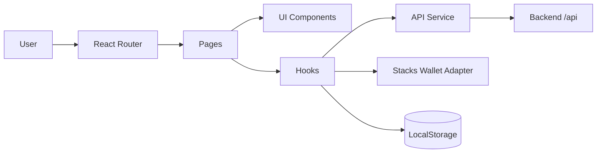
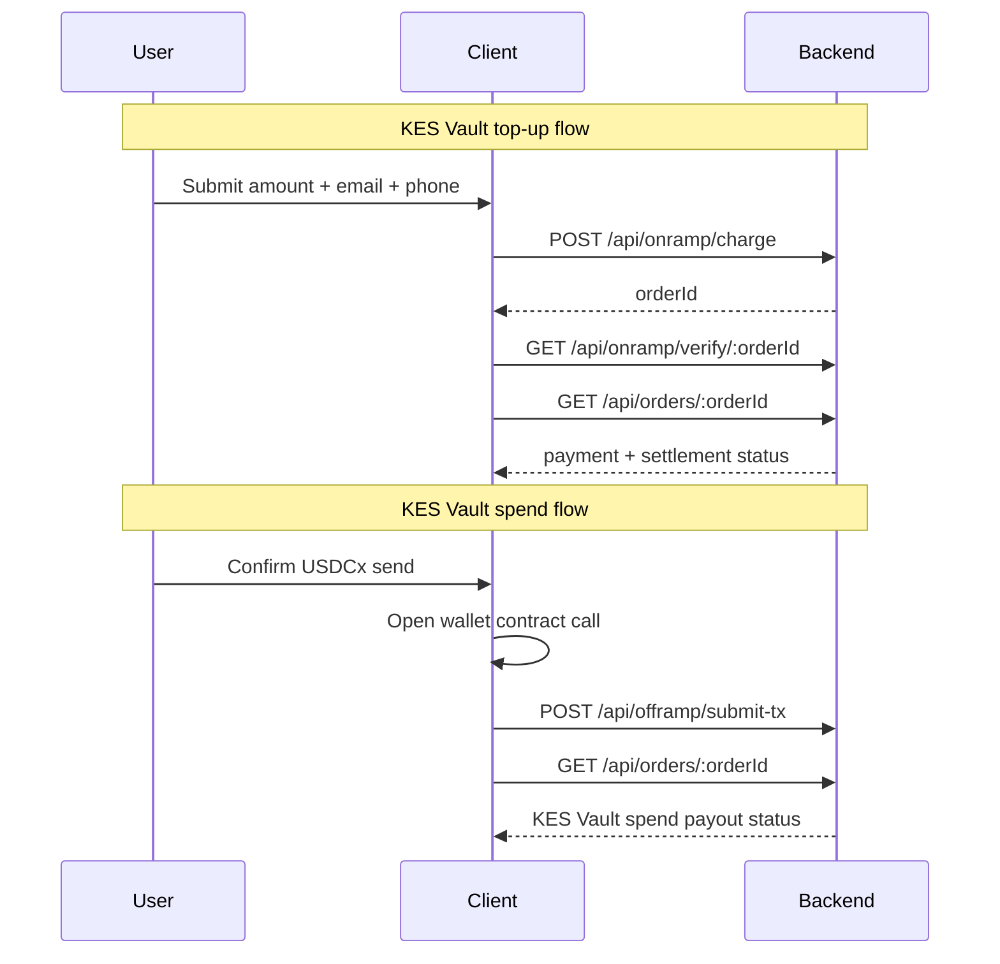

# AureSpend Client

<div align="center">


</div>

Production-oriented frontend for AureSpend settlement operations, built with React, TypeScript, Vite, Tailwind CSS, and shadcn/ui.

## Description

The client is the user-facing orchestration layer for all KES Vault ↔ USDCx flows. It handles wallet connectivity, form validation, progress state, settlement polling, and final UX confirmations for both top-up and spend journeys.

## What It Solves

Cross-rail flows are complex for users because blockchain and mobile-money steps happen asynchronously.

This client solves:
- fragmented UX between wallet, payment, and settlement states,
- uncertainty around transaction progress,
- fragile browser-session continuity,
- weak visibility into success/failure outcomes.

## How It Solves It

1. **Flow-first pages**
   - Dedicated route-driven experiences for dashboard, topup, and spend.
2. **Typed API contract**
   - Strong request/response typing from shared domain models.
3. **Stateful polling model**
   - Order progress polling with terminal-state handling and timeout fallback.
4. **Wallet abstraction**
   - Stacks connect/disconnect encapsulated in a reusable hook.
5. **Persistent resume support**
   - Local storage recovers in-flight journeys after refresh/reopen.

## Key Features

### 1) Wallet-Connected Dashboard
- Detects and restores previous wallet sessions.
- Presents clear entry points into spend and topup actions.
- Keeps wallet actions accessible on desktop and mobile nav.

### 2) KES Vault Top-up (KSH → USDCx)
- Validates amount/email/phone before charge initiation.
- Triggers backend KES Vault top-up charge and STK push flow.
- Transitions through `details → paying → confirming → complete`.
- Tracks progress until backend marks crypto settlement complete.

### 3) KES Vault Spend (USDCx → KSH)
- Collects amount and destination phone.
- Opens wallet contract call for token transfer initiation.
- Submits transaction details for backend verification and payout.
- Transitions through `details → send → verifying → complete`.

### 4) Robust Order State Handling
- Uses backend verification endpoints per flow stage.
- Supports session resume with local storage order keys.
- Handles failed and timeout states with user-friendly recovery actions.

## Client-Side Architecture

### Architectural Flow: Structure



### Architectural Flow: Runtime Design



## Route Map

| Route | Page | Responsibility |
|---|---|---|
| `/` | `Dashboard.tsx` | Wallet-gated landing and action selection |
| `/topup` | `Topup.tsx` | KES Vault top-up form, payment stage, and settlement confirmation |
| `/spend` | `Spend.tsx` | KES Vault spend flow including contract-call initiation and payout tracking |
| `*` | `NotFound.tsx` | Fallback route |

## Folder Structure (Current)

```text
client/
├─ src/
│  ├─ App.tsx
│  ├─ main.tsx
│  ├─ pages/
│  │  ├─ Dashboard.tsx
│  │  ├─ Topup.tsx
│  │  ├─ Spend.tsx
│  │  └─ NotFound.tsx
│  ├─ components/
│  │  ├─ Navbar.tsx
│  │  ├─ BottomNav.tsx
│  │  ├─ Stepper.tsx
│  │  ├─ StatusIndicator.tsx
│  │  ├─ QRCodeDisplay.tsx
│  │  ├─ WalletButton.tsx
│  │  └─ ui/
│  ├─ hooks/
│  │  ├─ useWallet.ts
│  │  ├─ usePollOrder.ts
│  │  ├─ use-mobile.tsx
│  │  └─ use-toast.ts
│  ├─ services/
│  │  └─ api.ts
│  ├─ types/
│  │  └─ index.ts
│  └─ test/
│     └─ ...
└─ ...
```

## Core Hooks and Services

### Hooks
- `useWallet.ts`
  - Handles connect/disconnect and persisted wallet session restoration.
- `usePollOrder.ts`
  - Generalized order polling utility with env-driven storage prefix support.

### API Service
- `src/services/api.ts` wraps:
  - `getRate`
  - `getServerAddress`
  - `chargeOnramp`
  - `verifyOnramp`
  - `submitOfframpTx`
  - `getOrder`

## Environment Configuration

Create `client/.env`:

```bash
VITE_API_BASE=http://localhost:4000
VITE_STORAGE_KEY_PREFIX=aurespend_order_
```

## Local Development

```bash
npm install
npm run dev
```

Vite serves the app locally; ensure backend API is running and reachable via `VITE_API_BASE`.

## Build, Lint, and Test

```bash
npm run lint
npm run test
npm run build
npm run preview
```

## Security and Quality Notes

- Frontend environment variables must not contain private secrets.
- Keep all sensitive validation and authorization server-side.
- Treat browser local storage as convenience state, not trust state.
- Keep wallet transaction confirmations explicit in UI before chain actions.
- Preserve typed API contracts to avoid runtime request/response drift.

## Documentation Links

- Project overview: [../README.md](../README.md)
- Backend reference: [../server/README.md](../server/README.md)
- Contract reference: [../contracts/README.md](../contracts/README.md)

---

AureSpend Client is built for a clear, reliable, and verifiable user experience across every settlement step.
