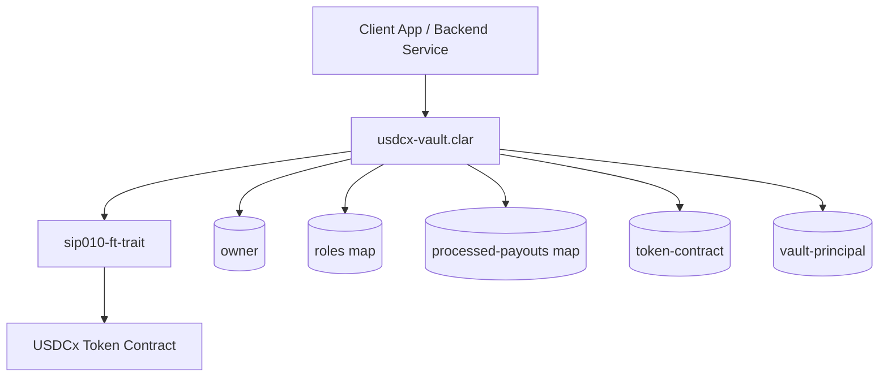
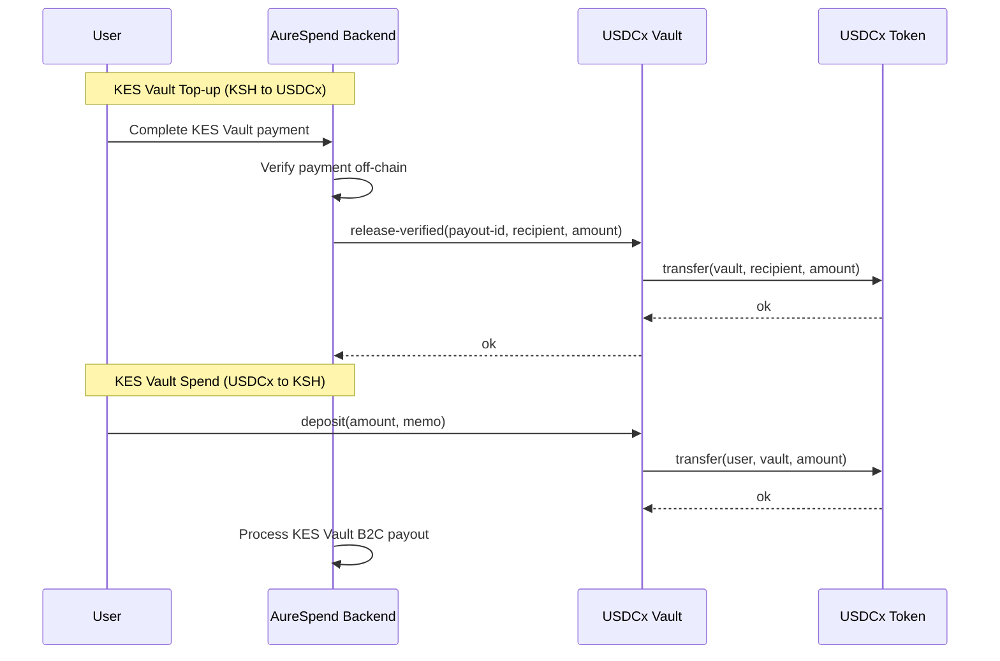
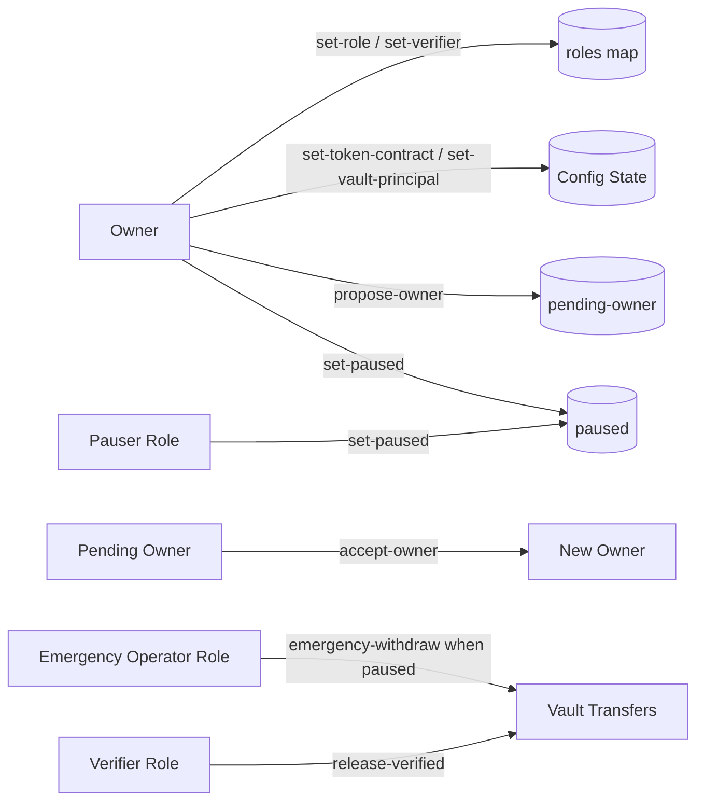
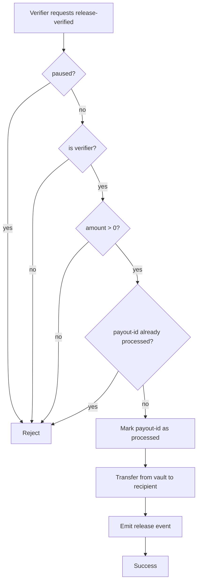

# AureSpend Contracts

<div align="center">


</div>

Production-oriented Clarity contracts powering AureSpend KES Vault ↔ crypto conversion flows.

This package contains:
- A SIP-010 trait interface for fungible token operations.
- A role-based vault contract for controlled USDCx custody, verified payouts, and emergency controls.

## Description

AureSpend Contracts provide a secure execution layer for KES Vault top-up and KES Vault spend settlement:
- Accepts user token deposits into a configured vault principal.
- Releases USDCx only through authorized verifier flows.
- Prevents replay and duplicate payouts using payout identifiers.
- Supports controlled operations through ownership transfer, pause controls, and role-based permissions.

## What It Solves

Fiat-crypto systems often fail in predictable ways:
- Unauthorized token release or weak role governance.
- Replay and double settlement risk.
- No emergency controls for active incidents.
- Unclear separation between operational and recovery privileges.

This package addresses those risks directly with explicit vault controls and auditable on-chain logic.

## How It Solves It

1. Strict access control
   - Owner-managed roles for verifier, pauser, and emergency operator.
2. Operational safety
   - Pause gate for sensitive operations and controlled reconfiguration.
3. Replay protection
   - Processed payout map keyed by payout-id buffer.
4. Secure ownership handoff
   - Two-step owner transfer: propose and accept.
5. Typed token interaction
   - SIP-010 trait enforcement for transfer and balance operations.

## Key Features (Detailed)

### 1) Role-Based Authorization
- Owner: governance and privileged configuration.
- Verifier role: executes verified disbursements.
- Pauser role: can pause or resume operations.
- Emergency operator role: can recover funds while paused.

### 2) Replay-Safe Verified Payouts
- Every payout requires a unique payout-id (buff 32).
- Once processed, payout-id cannot be used again.
- This prevents duplicate disbursements from retries or malicious replay.

### 3) Controlled Vault Configuration
- Token contract and vault principal are explicit state variables.
- Reconfiguration is guarded by owner checks and pause requirements.
- This reduces misconfiguration risk during live operations.

### 4) Incident Response & Recovery
- Global pause stops normal flows quickly.
- Emergency withdraw is restricted and only available while paused.
- Enables controlled treasury protection during incidents.

## Contract Structure

### Architectural Flow: Module Structure



### Architectural Flow: KES Vault Top-up/Spend Design Flow



### Architectural Flow: Contract Access Control Paths



### Architectural Flow: Payout Safety Lifecycle



## Code Paths

### Files
- contracts/traits/usdcx-traits.clar
- contracts/usdcx-vault.clar
- Clarinet.toml

### Primary Public Methods

| Method | Purpose | Access |
|---|---|---|
| propose-owner(new-owner) | Start ownership transfer | Owner |
| accept-owner() | Complete ownership transfer | Pending owner |
| cancel-owner-transfer() | Cancel transfer process | Owner |
| set-paused(value) | Pause/unpause operations | Owner or Pauser |
| set-token-contract(token) | Configure token contract principal | Owner |
| set-vault-principal(vault) | Configure custody principal | Owner |
| set-role(who, role, allowed) | Assign/revoke role | Owner |
| set-verifier(who, allowed) | Convenience verifier assignment | Owner |
| deposit(amount, memo) | Move USDCx from user to vault | Any caller, gated by state |
| release-verified(payout-id, recipient, amount, memo) | Release vault funds after verification | Verifier |
| emergency-withdraw(recipient, amount, memo) | Recovery transfer while paused | Owner or Emergency Operator |
| vault-balance() | Query balance from configured token | Public |

## Security Model

### Access Control
- Role checks are explicit and separated by operational duty.
- Invalid roles are rejected.

### Configuration Safety
- Token and vault principal setup requires owner privileges.
- Mutations can be constrained by pause state.

### Settlement Integrity
- Non-zero amount assertions on value-moving operations.
- Processed payout IDs block duplicates.

### Operational Resilience
- Pause control supports immediate risk containment.
- Emergency withdraw works only in paused state.

## Setup & Verification

### Prerequisites
- Clarinet installed
- Stacks toolchain for deployment workflows

### Local checks

```bash
clarinet check
```

### Example deployment plan
- Use deployments/default.testnet-plan.yaml
- Configure network settings under settings/Testnet.toml

## Integration Notes

- Backend services should generate deterministic payout-id values per settlement request.
- Off-chain verification (KES Vault callbacks, compliance checks, anti-fraud checks) must complete before calling release-verified.
- Keep owner and role keys in secure custody with strict operational procedures.

## Production Guidance

- Apply multi-party controls for owner key usage.
- Maintain rotation procedures for verifier/pauser/emergency roles.
- Add contract test coverage for:
  - role assignment and revocation
  - replay rejection
  - pause behavior
  - emergency withdraw gating
  - ownership transfer edge cases

---

AureSpend Contracts are designed to be minimal, explicit, and safety-first for real settlement workloads.
