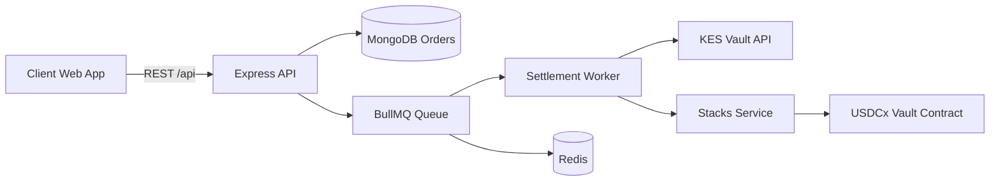
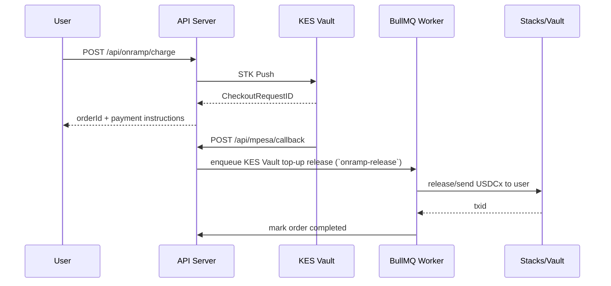
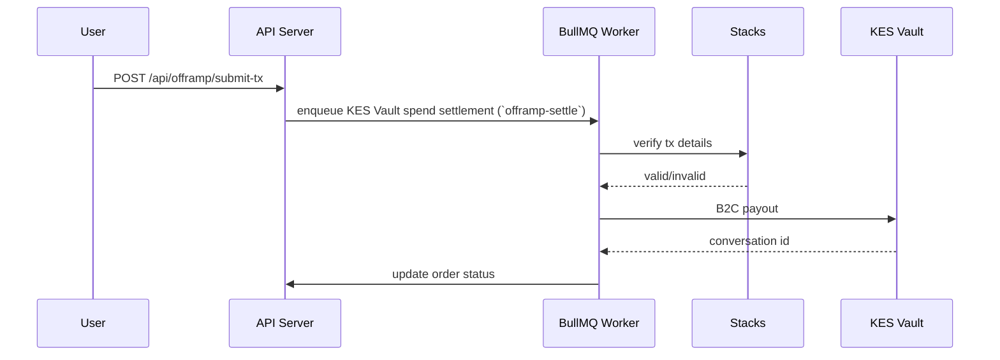
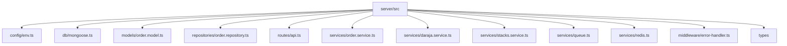

# AureSpend Server

<div align="center">


</div>

Backend settlement engine for AureSpend, built with Node.js, TypeScript, MongoDB, Redis/BullMQ, Safaricom KES Vault (Daraja), and Stacks contract integration.

## Description

This service powers end-to-end KES Vault ↔ USDCx settlement workflows:
- **KES Vault Top-up**: initiates STK push, confirms payment callbacks, then releases USDCx to user.
- **KES Vault Spend**: verifies on-chain user transaction, then triggers B2C payout.
- **Persistence**: tracks full lifecycle in MongoDB with auditable logs.
- **Orchestration**: uses BullMQ for reliable retries and delayed timeout jobs.

## What It Solves

A production KES Vault top-up/spend backend must solve hard reliability and security problems:
- Coordinating asynchronous blockchain + mobile money events.
- Handling retries, callbacks, and eventual consistency safely.
- Preventing silent failures in payout workflows.
- Preserving auditability for support, compliance, and incident response.

AureSpend Server solves this by combining strict API validation, durable order state, queue-backed job orchestration, and guarded integration boundaries.

## How It Solves It

1. **Validated API surface**
   - Zod schemas validate all input payloads before business logic.
2. **Durable order state machine**
   - MongoDB order model captures type, status, settlement refs, tx refs, and log trail.
3. **Queue-based orchestration**
   - Redis + BullMQ process settlement jobs with retries, exponential backoff, and delayed timeouts.
4. **Integration abstraction**
   - KES Vault (Daraja) and Stacks are isolated behind dedicated service adapters.
5. **Operational guardrails**
   - Helmet, CORS controls, rate limiting, structured error handling, and callback endpoints.

## Key Features (Detailed)

### 1) KES Vault-First Fiat Settlement
- STK push for top-up collection.
- B2C payout for spend disbursement.
- Callback endpoint handling for payment confirmation.
- Mock mode for local development without live credentials.

### 2) Contract-Aware Settlement Layer
- Uses vault-oriented Stacks service abstraction.
- Releases top-up crypto only after fiat confirmation.
- Verifies spend chain evidence before fiat payout.
- Keeps blockchain execution concerns separate from route handlers.

### 3) Redis MQ + Scheduling Jobs
- `onramp-release` for KES Vault top-up token release.
- `offramp-settle` for KES Vault spend payout execution after tx verification.
- `onramp-timeout` delayed job for stale KES Vault top-up sessions.
- Built-in retry/backoff and failure event logging.

### 4) Security & Resilience by Default
- Request hardening via Helmet.
- Rate limiting to reduce abuse and accidental load spikes.
- CORS policy enforcement.
- Centralized error middleware and explicit HTTP status handling.

## Architecture

### Architectural Flow: High-Level Design



### Architectural Flow: KES Vault Top-up Sequence



### Architectural Flow: KES Vault Spend Sequence



## API Surface

| Method | Endpoint | Purpose |
|---|---|---|
| GET | `/api/rate` | Returns KES/USDCx conversion rate |
| GET | `/api/server-address` | Returns server Stacks address |
| POST | `/api/onramp/charge` | Creates KES Vault top-up order + initiates STK push |
| GET | `/api/onramp/verify/:orderId` | Checks KES Vault top-up settlement status |
| POST | `/api/offramp/submit-tx` | Submits KES Vault spend tx details |
| GET | `/api/orders/:orderId` | Returns order snapshot |
| POST | `/api/mpesa/callback` | KES Vault STK callback receiver |
| POST | `/api/mpesa/b2c/result` | KES Vault B2C result callback |
| POST | `/api/mpesa/b2c/timeout` | KES Vault B2C timeout callback |
| GET | `/health` | Health probe |

## Folder Structure



## Code Paths and Responsibilities

- **Route layer**: request validation + response formatting.
- **Service layer**: business workflow and orchestration decisions.
- **Repository layer**: persistence and status/log transitions.
- **Integration layer**: KES Vault (Daraja) and Stacks external calls.
- **Queue worker layer**: asynchronous settlement, retries, and delayed jobs.

## Security Standards

### System Strength & Robustness
- Queue-driven retries and delayed jobs make settlement resilient to transient failures.
- MongoDB order-state persistence prevents silent state loss across restarts.
- Explicit callback handling ensures deterministic transitions for KES Vault payment states.
- Service-layer separation (API, queue, integration adapters) improves maintainability and operational safety.

### API Security
- Helmet-enabled secure headers.
- Request body limit (`1mb`) to reduce abuse surface.
- CORS allowlist via `CORS_ORIGIN`.
- Rate limiting enabled globally.

### Data Integrity
- Zod runtime schema validation for API payloads.
- Controlled status transitions through service/repository methods.
- Immutable-style log append for traceability.

### Secrets & Credentials
- Credentials loaded from environment only.
- Mock modes (`ENABLE_DARAJA_MOCK`, `ENABLE_STACKS_MOCK`) prevent accidental production-side calls during development.

### Queue Safety
- Retry with exponential backoff.
- Failed job events appended to order logs.
- Delayed timeout jobs prevent stuck transactions.

## Environment Variables

See [.env.example](.env.example) for the full template.

Critical groups:
- **Core**: `PORT`, `MONGODB_URI`, `CORS_ORIGIN`
- **Queue**: `REDIS_URL`, `QUEUE_PREFIX`
- **Stacks**: `SERVER_STACKS_ADDRESS`, `STACKS_*`, `KES_PER_USDCX`
- **KES Vault (Daraja)**: `DARAJA_*`, callback URLs, shortcode credentials

## Local Development

```bash
npm install
npm run dev
```

Server starts on `PORT` and also starts settlement workers.

### Build & Type Check

```bash
npm run check
npm run build
npm start
```

## Operations Runbook

### Recommended production setup
- Use managed MongoDB and Redis with TLS.
- Disable mock flags in production.
- Restrict callback endpoints through network controls and upstream gateway rules.
- Add observability (structured logs, metrics, alerting on failed jobs).
- Rotate KES Vault (Daraja) and blockchain credentials regularly.

### Failure handling
- Inspect order logs in MongoDB for integration trace.
- Replay safe operations via queued retries.
- Requeue specific orders using queue tooling when external outage recovers.

## Notes for Contract Integration

- Current Stacks adapter is structured for vault interaction and verification flow.
- Replace placeholder transaction logic in `stacks.service.ts` with signed contract-call implementation for production mainnet/testnet execution.

---

AureSpend Server is designed for reliability-first settlement operations: explicit workflows, secure defaults, and scalable async execution.
